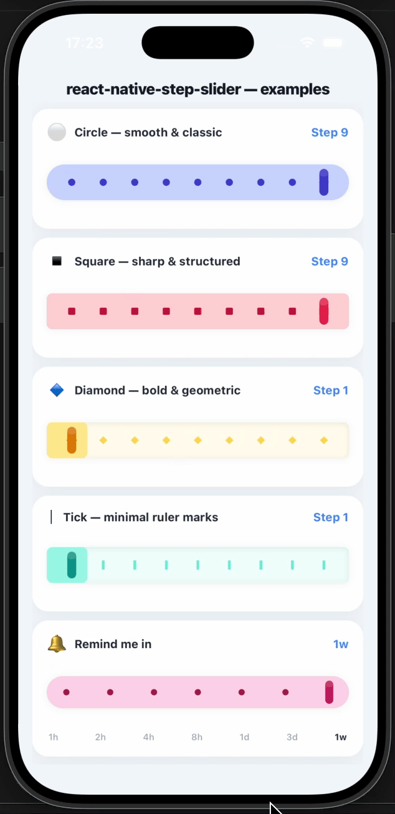
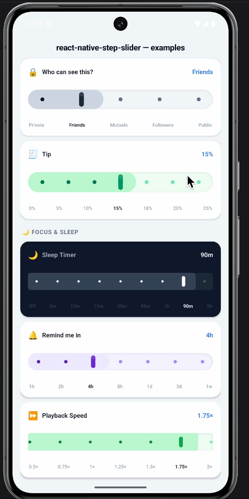

<div align="center">

<table>
  <tr>
    <th align="center">iOS</th>
    <th align="center">Android</th>
  </tr>
  <tr>
    <td align="center">
      
    </td>
    <td align="center">
      
    </td>
  </tr>
</table>


<h1>react-native-step-slider</h1>

<p>A beautifully animated step slider for React Native — with spring snap and tap-to-select gestures.</p>

<p>
  
  
  
  
</p>

</div>

---

## ✨ Features

- 📱 **Works on iOS & Android** — consistent behaviour and look across both platforms
- 🎨 **Fully customisable** — colours, step count, size, shape and layout
- ⚡ **Silky smooth performance** — animations and gestures never block your UI
- 🎯 **Tap to jump** — tap any step marker to jump straight to that position
- 🟣 **Active step pulse** — the selected step marker pops with a springy highlight
- 🌊 **Progress fill** — a live fill tracks your position across the slider

---

## Installation

```sh
npm install react-native-step-slider
# or
yarn add react-native-step-slider
```

### Peer dependencies

Install all three peer packages if they aren't already in your project:

```sh
npm install @shopify/react-native-skia react-native-reanimated react-native-gesture-handler react-native-worklets
```

| Package | Minimum version |
|---|---|
| `@shopify/react-native-skia` | `>= 1.0.0` |
| `react-native-reanimated` | `>= 3.0.0` |
| `react-native-gesture-handler` | `>= 2.0.0` |
| `react-native-worklets` | `^0.8.1` |
| `react` | `>= 18` |
| `react-native` | `>= 0.72` |

### iOS

```sh
cd ios && pod install
```

### Babel config

Make sure `react-native-reanimated/plugin` is the **last** item in your `babel.config.js` plugins array:

```js
// babel.config.js
module.exports = {
  presets: ['module:@react-native/babel-preset'],
  plugins: ['react-native-reanimated/plugin'],
};
```

---

## Quick start

Wrap your app in `GestureHandlerRootView` (once, at the root) and drop in `StepSlider`:

```tsx
import React, { useState } from 'react';
import { Text, View } from 'react-native';
import { GestureHandlerRootView } from 'react-native-gesture-handler';
import { StepSlider } from 'react-native-step-slider';

export default function App() {
  const [step, setStep] = useState(5);

  return (
    <GestureHandlerRootView style={{ flex: 1 }}>
      <View style={{ padding: 32 }}>
        <Text>Step {step + 1} of 11</Text>
        <StepSlider stepCount={11} defaultIndex={5} onValueChange={setStep} />
      </View>
    </GestureHandlerRootView>
  );
}
```

---

## Props

| Prop | Type | Default | Description |
|---|---|---|---|
| `stepCount` | `number` | `11` | Number of selectable step positions. |
| `defaultIndex` | `number` | `Math.floor(stepCount / 2)` | Initially selected index (0-based). |
| `width` | `number` | `screenWidth − 64` | Total width of the slider track in dp. |
| `trackHeight` | `number` | `56` | Height of the pill-shaped track in dp. |
| `trackRadius` | `number` | `trackHeight / 2` | Corner radius of the track. |
| `stepRadius` | `number` | `3.5` | Radius of each step marker in dp. |
| `stepShape` | `StepShape` | `'circle'` | Shape of the step markers — `'circle'`, `'square'`, `'diamond'`, or `'tick'`. |
| `thumbWidth` | `number` | `7` | Width of the thumb pill in dp. |
| `thumbHeight` | `number` | `trackHeight × 0.62` | Height of the thumb pill in dp. |
| `showThumbGloss` | `boolean` | `true` | Show the gloss sheen overlay on the thumb. |
| `showThumb` | `boolean` | `true` | Render the thumb at all. Set to `false` to hide it completely — handy when `renderStepShape` provides enough visual feedback on its own. |
| `rtl` | `boolean` | `I18nManager.isRTL` | Enable right-to-left layout. Index 0 becomes the rightmost step, the progress fill grows from right to left, and dragging right decreases the index. Auto-detected from the device locale by default. |
| `stepPaddingStart` | `number` | `trackRadius` | Space between the track's left edge and the first step marker. |
| `stepPaddingEnd` | `number` | `trackRadius` | Space between the last step marker and the track's right edge. |
| `colors` | `StepSliderColors` | *(blue theme)* | Override any or all colour tokens. |
| `onValueChange` | `(index: number) => void` | `undefined` | Called every time the selected index changes. |
| `renderStepShape` | `(info: StepRenderInfo) => ReactNode` | `undefined` | Replace the built-in Skia step markers with any React Native element. See [Custom step shapes](#custom-step-shapes). |
| `renderThumb` | `(info: ThumbRenderInfo) => ReactNode` | `undefined` | Replace the built-in Skia thumb with any React Native element, animated with the same spring physics. See [Custom thumb](#custom-thumb). |

---

## RTL (right-to-left) support

`react-native-step-slider` has built-in RTL support.

### Auto-detection

The slider reads `I18nManager.isRTL` automatically — no extra config needed.
If your app calls `I18nManager.forceRTL(true)` and restarts, the slider will flip
out of the box.

### Explicit override

Pass `rtl` to force a direction regardless of the device locale:

```tsx
{/* Always RTL */}
<StepSlider stepCount={7} rtl={true} onValueChange={setStep} />

{/* Always LTR */}
<StepSlider stepCount={7} rtl={false} onValueChange={setStep} />
```

### What flips in RTL mode

| Behaviour | LTR | RTL |
|---|---|---|
| Index 0 position | leftmost | rightmost |
| Progress fill | grows left → right | grows right → left |
| Pan gesture | drag right = higher index | drag right = lower index |
| `onValueChange` | 0 = left step | 0 = right step |
| `defaultIndex` | 0 = left step | 0 = right step |

> **`stepPaddingStart` / `stepPaddingEnd`** follow the *logical* direction — `start` is the leading edge (left in LTR, right in RTL).

---

## Custom step shapes

Pass `renderStepShape` to replace the built-in dot/tick/diamond markers with **any React Native element**.
When this prop is set the Skia markers are hidden and a transparent RN overlay is rendered on top of the canvas instead.

Each step receives a **100 × 100 dp container** anchored at `(stepX − 50, trackCY − 50)`.
No alignment is forced — position your content freely inside it.

```tsx
import { StepSlider, type StepRenderInfo } from 'react-native-step-slider';
import { View } from 'react-native';

<StepSlider
  stepCount={5}
  renderStepShape={({ index, isActive }: StepRenderInfo) => (
    // Centre a small square in the 100×100 container
    <View
      style={{
        position: 'absolute',
        width: 14,
        height: 14,
        top: 43,   // 50 − 7
        left: 43,  // 50 − 7
        borderRadius: 3,
        backgroundColor: isActive ? '#6366f1' : '#c7d2fe',
      }}
    />
  )}
/>
```

### `StepRenderInfo`

| Field | Type | Description |
|---|---|---|
| `index` | `number` | Zero-based index of this step. |
| `isActive` | `boolean` | `true` when this step is the currently selected one. |
| `x` | `number` | Centre X of this step on the canvas, in dp. |
| `y` | `number` | Centre Y of the track (canvas centre), in dp. |

> **Centering tip** — to centre a `W × H` element use `position:'absolute', left: (100 − W) / 2, top: (100 − H) / 2`,
> or wrap it in a `<View style={{ flex:1, alignItems:'center', justifyContent:'center' }}>` that fills the 100 × 100 box.

---

## Custom thumb

Pass `renderThumb` to replace the built-in Skia pill thumb with **any React Native element**.
The element is animated automatically with the same spring-and-squish physics as the default thumb.

The view is centred on the thumb's current X position — use `transform` or `margin` to offset if needed.
`thumbWidth` and `thumbHeight` from props are forwarded as a sizing hint.

```tsx
import { StepSlider, type ThumbRenderInfo } from 'react-native-step-slider';
import { View } from 'react-native';

<StepSlider
  stepCount={7}
  thumbWidth={28}
  thumbHeight={28}
  renderThumb={({ thumbWidth, thumbHeight }: ThumbRenderInfo) => (
    <View
      style={{
        width: thumbWidth,
        height: thumbHeight,
        borderRadius: thumbWidth / 2,
        backgroundColor: '#6366f1',
        shadowColor: '#6366f1',
        shadowOpacity: 0.5,
        shadowRadius: 6,
        elevation: 4,
      }}
    />
  )}
/>
```

### `ThumbRenderInfo`

| Field | Type | Description |
|---|---|---|
| `activeIndex` | `number` | Currently selected step index (0-based). |
| `thumbWidth` | `number` | Value of the `thumbWidth` prop (or its default). |
| `thumbHeight` | `number` | Value of the `thumbHeight` prop (or its default). |

---

## StepSliderColors

All fields are optional — only provide the tokens you want to override.

| Field | Default | Description |
|---|---|---|
| `track` | `'#dbeafe'` | Track background fill. |
| `fill` | `'#bfdbfe'` | Progress fill (left of thumb). |
| `stepActive` | `'#3b82f6'` | Step marker colour when active (at or left of thumb). |
| `stepInactive` | `'#93c5fd'` | Step marker colour when inactive (right of thumb). |
| `thumb` | `'#3b82f6'` | Thumb pill colour. |
| `thumbShadow` | `'rgba(59,130,246,0.5)'` | Thumb drop-shadow colour. |

```tsx
<StepSlider
  stepCount={7}
  stepShape="diamond"
  colors={{
    track: '#fdf2f8',
    fill: '#fbcfe8',
    stepActive: '#ec4899',
    stepInactive: '#f9a8d4',
    thumb: '#ec4899',
    thumbShadow: 'rgba(236,72,153,0.45)',
  }}
  onValueChange={(i) => console.log('selected:', i)}
/>
```

---

## Example app

Two runnable demo screens live in the [`demos/`](./demos) folder:

| File | What it covers |
|---|---|
| [`demos/Demos.tsx`](./demos/Demos.tsx) | Real-world use cases — volume, brightness, font size, sleep timer, filters, ratings, fitness and more, using the built-in step shapes and thumb. |
| [`demos/CustomStepDemos.tsx`](./demos/CustomStepDemos.tsx) | Full showcase of `renderStepShape` and `renderThumb` — custom visuals and RTL examples. |

---

## How it works

The slider is rendered on a single hardware-accelerated canvas, so every dot, the progress fill and the animated thumb are drawn in one efficient pass — no layout thrashing. Animations run on a dedicated UI thread, meaning dragging and snapping stay perfectly smooth even when your JavaScript is busy. The `onValueChange` callback is only fired when the selected step actually changes, keeping unnecessary re-renders to a minimum.

---

## ⭐ Support

If you find this library useful, please consider **[starring the repo](https://github.com/ismnoiet/react-native-step-slider)** — it helps others discover it and motivates further development.

---

## Contributing

Contributions are welcome! Please open an issue first to discuss what you'd like to change.

---

## License

MIT © [ismnoiet](https://github.com/ismnoiet) — see [LICENSE](./LICENSE) for details.
